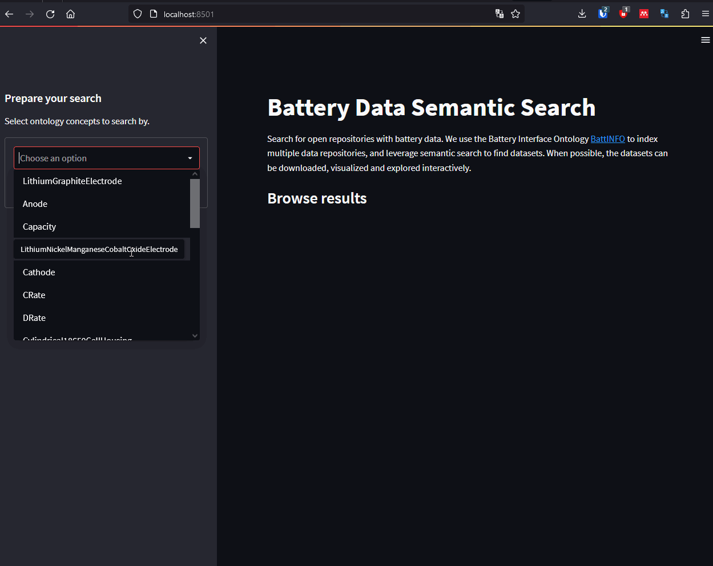
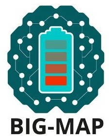

# Battery Data Semantic Search
This Python-based codebase demonstrates a concrete implementation of FAIR data principles. We use data and metadata from openly-available repository of battery data, and ingest it into an infrastructure to make such data:  

**Findable**: By mapping metadata to the common vocabulary of the BattINFO ontology, we leverage graph-based search to find datasets.

## How does it work
1. We collected metadata of battery datasets openly available:
    * The Toyota Research Institute Dataset
    * The Battery Archive datasets
2. We structured the metadata into a document store, i.e. a list of JSON objects, each with a unique identifier, and a set of key:value pairs describing the metadata. Example `"UUID_123_456":{"CRate": 0.5, "Anode": "Graphite",...}`
3. We mapped the metadata keys to ontological concepts defined in the BattINFO ontology, example `"Anode": "BattINFO#PositiveElectrode"`.
4. We mapped the metadata keys to their unique identifiers using the parthood relationin EMMO.
5. We built a graph database, including the BattINFO concepts, the metadata keys, and all their mappings.
6. We developed code to query the graph database using the RDFLIB API.
7. We developed a Graphical User Interface to demonstrate the search graphically. In the GUI the user selects one or more ontology concepts, and the software retreives the datasets mapped to these ontological concepts.

## How to use
* Install the packages in the `./requirements.txt` file. We reccomend using a virtual environment manager.
* In the command line run `streamlit run ./gui/app.py`. The graphical user interface should appear in the browser. 

**Note:** The battery archive has ended the support to download the datasets, so some of the URLs in the results might not resolve.

# Contributors
* **Eibar Flores**, SINTEF Inudstry, Norway.
* **Hannah Hansen**, SINTEF Industry, Norway.
* **Simon Clark**, SINTEF Indsutry, Norway.

# Aknowledgements
    

This project has received funding from the European Union’s Horizon 2020 research and innovation programme under grant agreement No 957189 ([BIG-MAP](https://www.big-map.eu/)).

# Developement notes

**Fun Fact:** We came up with a cool acronym for **Ba**ttery **Da**ta **S**emantic **S**earch, but it ended up being inappropiate to use :) 

## To do
* Have dataset-level triples: instead of having a metadata column with the same value across (e.g. if all cells are of the same cell type), delete such columns (free space) and encode a single mapping common to all datasets.
* Parse battinfo from the latest web version. Currently the local file `battinfo-merged.ttl` is used, but is not updated.
* Consider alternative separation of concerns: map IRIs only to uuids. Keep data in csv/sql. Query for uuids, and use them to access a DB. TinyDB could be an alternative.

## Versions
* DLite-Python == 0.3.15  
* BattINFO v0.3.0 dev_eibar branch (added some missing concepts)

## Good to know
* Column names in csv, which become property names in DLite, must use underscore notation to be a valid URI. E.g. `'Upper Voltage Cuttoff [V]'` bad, change instead by `'Upper_Voltage_Cuttoff_V'`. Otherwise DLite throws warning: `"uuid#Upper Voltage Cuttoff [V] does not look like a valid URI, trying to serialize this will break."`

